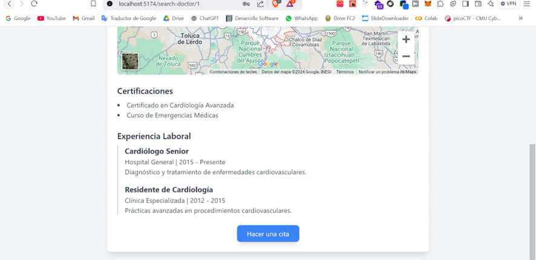

# Gestor de Pacientes - HealthAndSecure

Esta es una aplicacion pensada para que los doctores se publiciten de manera independiente y los clientes los busquen automáticamente. Y para que los doctores gestionar las citas que tenemos con los pacientes

## Backend

Desarrollada en NodeJs y Express.js y la base de datos desarrollada con SQLite.

### Deployment

```sh
git clone 
cd app-salud
npm install

# Para correr la API:
npm run dev

# Para correr el frontend:
cd client

npm run dev
```

## Frontend:

Desarrollado en React y TailwindCSS para consumir la API del backend.

### Panel de Doctor:





### Panel de Doctor:


